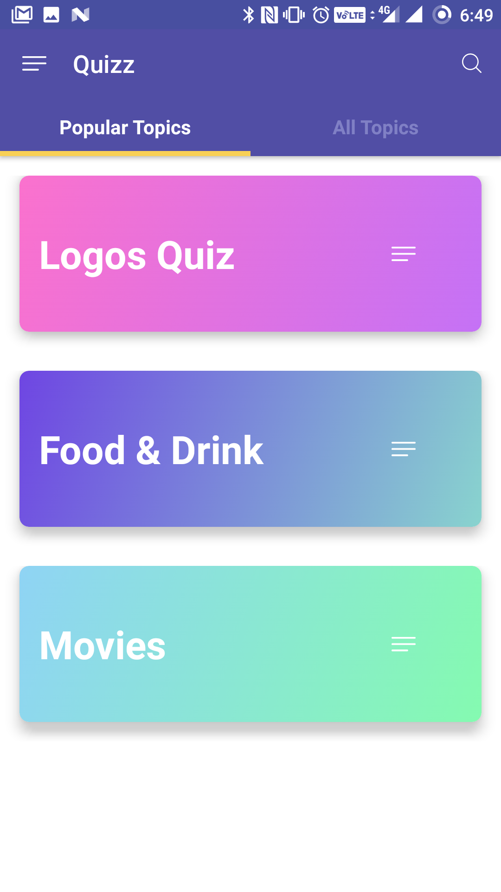
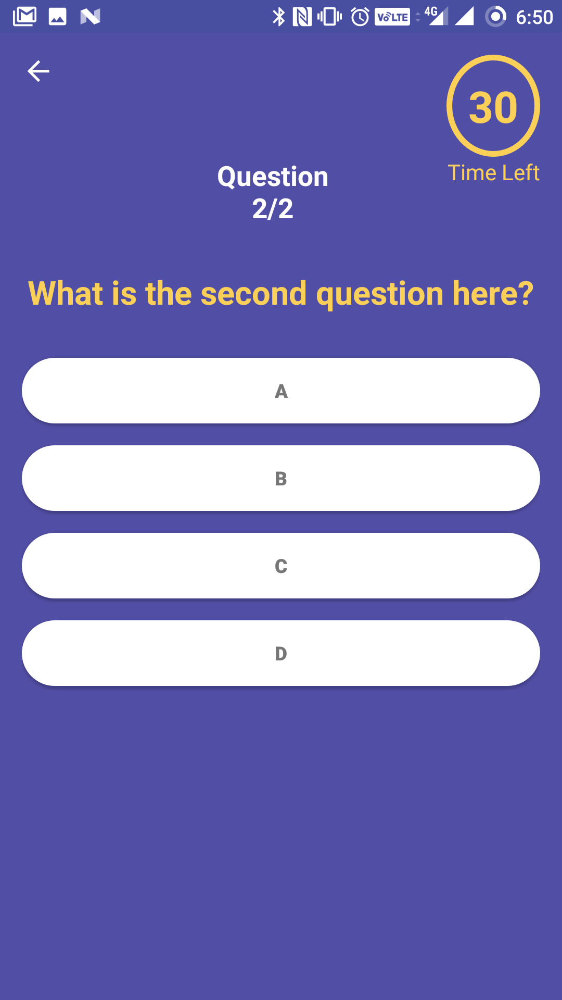
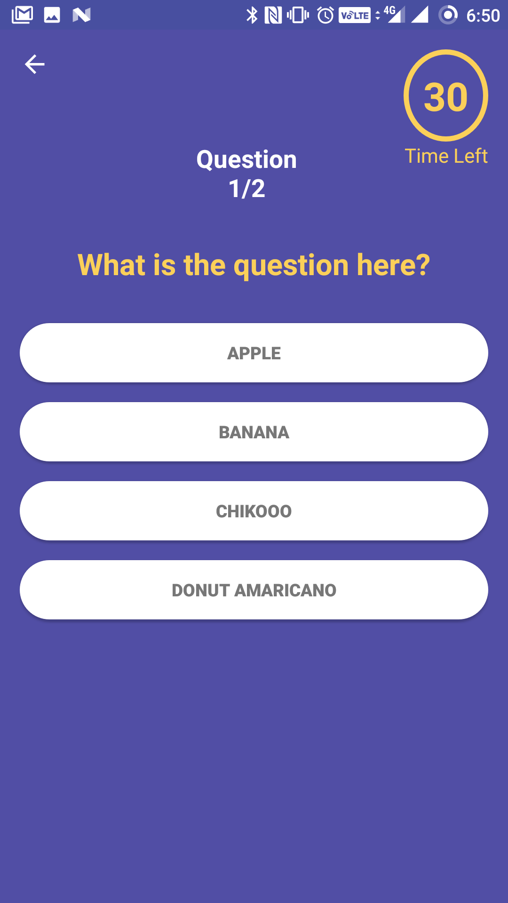
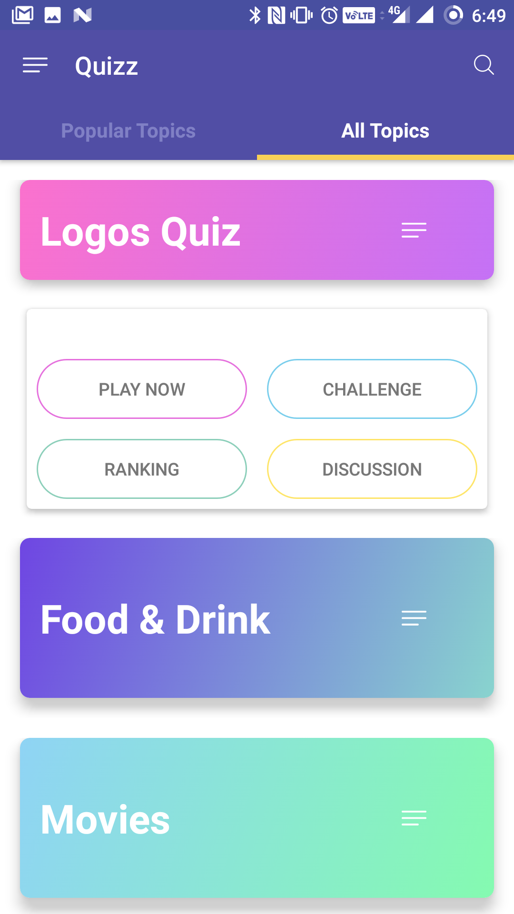

# Android-Club-VITCC

<b>Quiz APP</b>

An android based mobile application that can be used for conducting quiz in schools and colleges.  
Screen Shots:

  
  
  
  
   
   
     
  

<b>Home Automation:</b>

 
 
 
 

